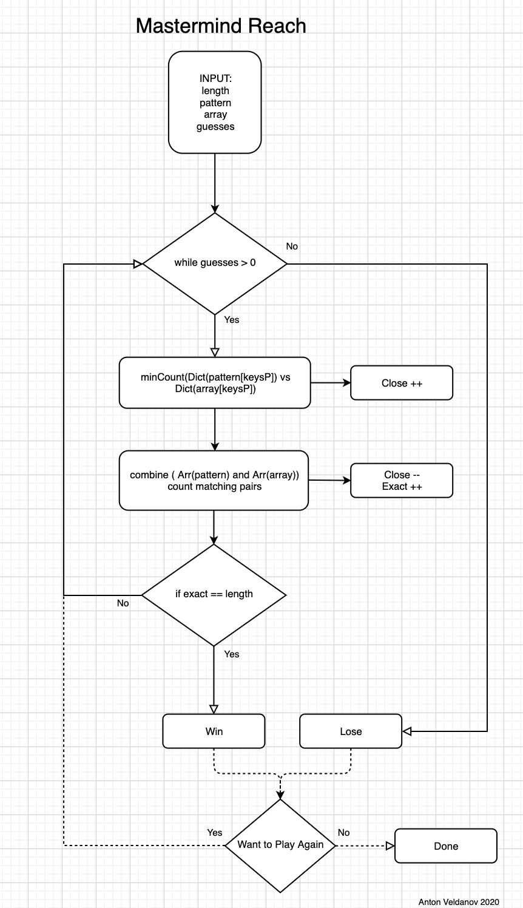

### System Requirements:
-    iOS – 13.2 or later
-    Mobile device model – iPhone 11 Pro Max
-    Xcode version – 11.3.1
-    Operation System – MacOS Catalina 10.15.3

### The goal

Implement a mastermind game, which can be played by a user "against" the computer.
This game where a player tries to guess the number combinations.
At the end of each attempt to guess the 4 number combinations, the computer will provide feedback whether the player had guessed a number correctly, or/and a number and digit correctly.
A player must guess the right number combinations within 10 attempts to win the game.

### What was created

Created an interactive Mastermind game app with enabled random number generator API from random.org. The app has a graphic UI interface that allows to select numbers by clicking respective buttons. 
 
 
### Technologies/technique used

-    Random.org API to generate random numbers
-    Use of graphic tools to great visuals - Canva and Appicon
-    Arrays and Dictionary manipulation
-    Sort, combine, zip
-    API session with a task to read and transfer data
-    While and For loops to control the flow of the app
-    Map methods and closures to map through elements of arrays/dictionaries
-    DispatchQueue.main.async method to run async GET requests
-    Xcode UIKit

### How to clone and run the app

Head over to the URL ( https://github.com/aveldanov/swiftproject/tree/master/MasterMind-iOS13 ) and use it to clone the starting project in Xcode.
Once the link is clicked it will open a page of the public GitHub repository that hosts the project files.
Then on the right side of the page click the green ‘click or download’ button. In the drop-down menu copy the link by pressing the ‘copy’ button. NOTE: The link refers to the actual project and its different from the GitHub page link of the project. 
Go back to Xcode. If no projects are opened, by opening Xcode you’ll see the welcome screen with the ‘clone an existing project’ option. Otherwise, you can go to the source control menu then clone option. Both options get you to the same screen to paste the URL you copied over from GitHub. As soon as pasted, proceed to cloning and save the project on your computer. Once it's done cloning you should see the project opened. 

### Project creation key milestones:

1.    Familiarized with the task and options of implementation. 
2.    Created initial app flow using draw.ai
3.    Build a basic functionality in Xcode command-line interface with a static input (pattern, array) - (https://github.com/aveldanov/swiftproject/tree/master/MasterMindPractice)
4.    Wireframed a basic UI design
5.    Created buttons, visuals using Canva and Appicon tools
6.    Build the UI interface using Xcode
7.    Moved functionality into the UI view
8.    Added a 90-second timer to complete the game
9.    Added a reset functionality to reset the game when you win, lose or time is over
10.    Tested functionality

### Next Steps

-    Refactoring the code into MVC
-    Deeper debugging
-    Optional: link to a database to manipulate the state
-    Add UI constraints
-    Building automation tests
-    Deploying in prod

### How to play

The pattern combination of 4 numbers is automatically generated. A player should enter numbers 0 through 7 using graphic buttons at the bottom of the screen. Then make sure to click the Check button to get feedback from the game whether the number is guessed correctly.  There are two types of hints.
Orange dots show the number of digits guess but the position is not correct. The green dots show that the digit and its position is correctly guessed. The player will have 10 attempts to guess the number. 

### App Flowchart Diagram

